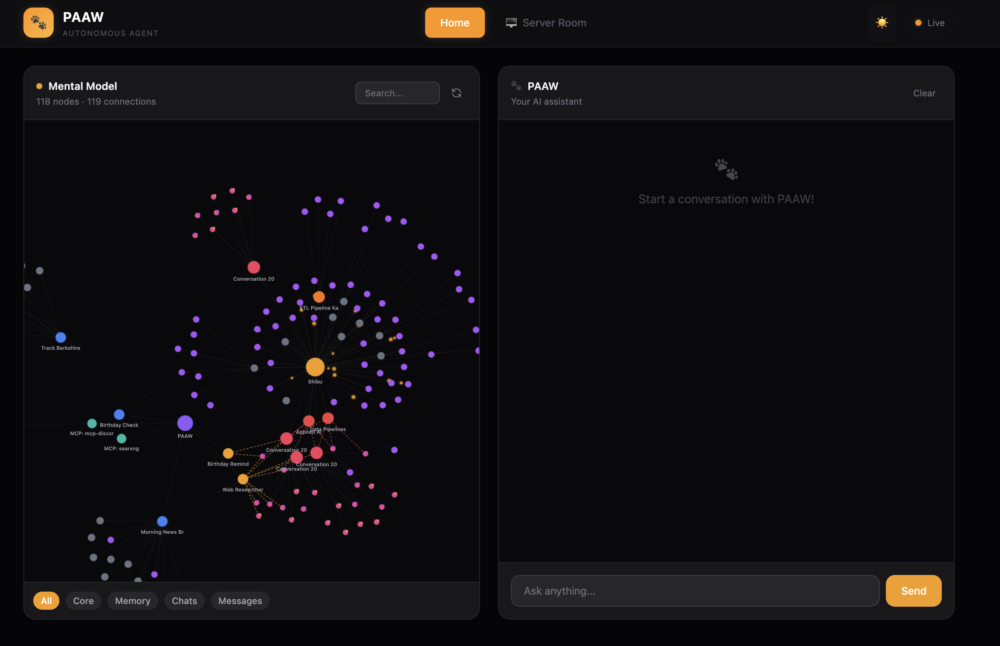
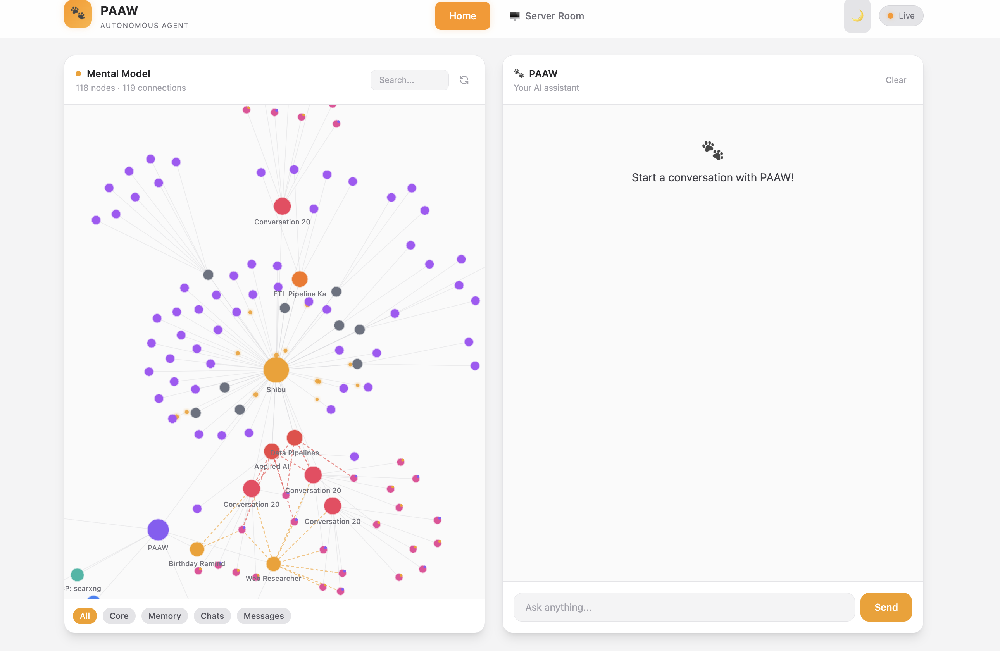

# PAAW

**An AI agent that builds a mental model of your life.**

```
 ██████╗  █████╗  █████╗ ██╗    ██╗
 ██╔══██╗██╔══██╗██╔══██╗██║    ██║
 ██████╔╝███████║███████║██║ █╗ ██║
 ██╔═══╝ ██╔══██║██╔══██║██║███╗██║
 ██║     ██║  ██║██║  ██║╚███╔███╔╝
 ╚═╝     ╚═╝  ╚═╝╚═╝  ╚═╝ ╚══╝╚══╝ 
```

Not just chat. Not just memory. PAAW connects people, work, and context — so it actually understands what you mean over time.

- **Remembers** conversations from weeks ago
- **Connects** context across projects, people, and tasks
- **Executes** tasks predictably — no random agent behavior

**Website**: [paaw.online](https://paaw.online)

---

### What this means in practice

- **Never repeat yourself.** PAAW traverses the graph to pull in related context — people, projects, deadlines, past decisions — so you never start a conversation from zero.
- **Nothing is forgotten.** Every conversation, every entity, every fact is stored in the graph and retrievable at any point.
- **Same brain, any channel.** Web UI, CLI, or Discord on your phone — PAAW carries the same context regardless of where you talk to it.
- **Connections compound.** The more you use PAAW, the richer the graph gets. Relationships between entities surface naturally over time.

| Dark Mode | Light Mode |
|-----------|------------|
|  |  |

---

## How it works

As AI gets more powerful, the real problem isn't intelligence — it's continuity.

Instead of storing conversations as text, PAAW stores how things are **connected**. It uses a knowledge graph (Apache AGE on PostgreSQL) that structures everything it learns about you into entities, relationships, and facts.

```
[You]
  |-- works_at ---------> [Company]
  |                            |-- located_in --> [San Francisco]
  |
  |-- interested_in ----> [AI/ML]
  |
  |-- manages ----------> [Project Alpha]
  |                            |-- deadline ----> [March 30]
  |
  +-- married_to -------> [Sarah]
                               |-- birthday ---> [April 15]
```

Every conversation enriches the graph. PAAW extracts entities, relationships, and key facts automatically — building a persistent model of your world that grows richer over time.

## Why not just use an autonomous agent?

LLMs are probabilistic systems. When you give an autonomous agent a vague goal and let it figure things out, you get unpredictable behavior and runaway token costs.

PAAW takes a different approach: **you define the patterns, PAAW executes them.**

- **Skills** describe *how* to do something (in plain English)
- **Jobs** describe *what* to do, *when* to run, and *where* to notify
- **Tools** are the capabilities PAAW can use (web search, Discord, any MCP server)

Predictable, repeatable automation — without the token burn. This isn't "ask it anything and hope for the best." This is structured automation with an LLM brain.

## Features

- **Mental Model** — Knowledge graph that grows with every conversation
- **User-Defined Skills & Jobs** — You define the patterns in plain English, PAAW executes
- **Tool Integration** — Web search, Discord, and any MCP-compatible server
- **Scheduled Automation** — Time-triggered jobs for monitoring, reporting, alerting
- **Self-Hosted** — Your knowledge graph and data stay on your machine
- **Multi-Channel** — Web UI, CLI, Discord (coming: Telegram, Slack)

## Quick Start (Docker)

### Prerequisites
- Docker & Docker Compose
- An LLM API key (Anthropic, OpenAI, or Groq)

> **Note:** PAAW relies heavily on tool calling. Use a model that supports it well — smaller models without strong tool-use capabilities will not work reliably. I recommend **Claude Sonnet 4** (`claude-sonnet-4-6`) — this entire app was built and tested on it, and I've spent about $10 over 2 weeks of active development and daily use.

### Setup

```bash
# Clone the repo
git clone https://github.com/SivaRamSV/paaw.git
cd paaw

# One-command start
./start.sh
```

The script will:
1. Check prerequisites
2. Create `.env` from template (add your API key when prompted)
3. Start all services (PostgreSQL, Valkey, SearXNG, PAAW)
4. Wait for everything to be ready

### Access

- **Web UI**: http://localhost:8080
- **Health Check**: http://localhost:8080/health
- **Search Engine**: http://localhost:8888 (SearXNG)

### Commands

```bash
./start.sh          # Start PAAW
./start.sh stop     # Stop all services
./start.sh restart  # Restart PAAW
./start.sh logs     # View logs
./start.sh status   # Check service status
```

## Local Development

```bash
# Create virtual environment
python -m venv .venv
source .venv/bin/activate

# Install dependencies
pip install -e ".[dev]"

# Start infrastructure (DB, cache, search)
docker compose up -d postgres valkey searxng

# Copy and configure environment
cp .env.example .env
# Edit .env and add your API key

# Run PAAW
python -m paaw.main

# Or use CLI
paaw chat
paaw status
paaw jobs list
```

## Configuration

### Environment Variables

| Variable | Description | Required |
|----------|-------------|----------|
| `ANTHROPIC_API_KEY` | Anthropic API key | One of these |
| `OPENAI_API_KEY` | OpenAI API key | required |
| `GROQ_API_KEY` | Groq API key | |
| `LLM_DEFAULT_MODEL` | Model to use (default: `claude-sonnet-4-6`) | No |
| `DATABASE_URL` | PostgreSQL connection string | Auto in Docker |
| `DISCORD_TOKEN` | Discord bot token for notifications | No |

### Jobs

Jobs are defined in `jobs/*/job.md`. They describe a repeatable task with a schedule:

```markdown
# SEC Filing Monitor

## Uses Skill
web_researcher

## Goal
Check for new SEC 10-K and 8-K filings from Berkshire Hathaway (BRK.B).
Summarize any material changes in holdings or significant events.

## Schedule
cron: 0 9 * * 1-5
timezone: Asia/Kolkata

## How To Notify
Send to Discord channel ID: 1234567890
```

Other examples: monitoring infrastructure logs for specific error patterns, tracking competitor product launches, aggregating daily news for a specific industry.

### Skills

Skills define reusable capabilities in `skills/*/skill.md`.

## Architecture

```
┌─────────────────────────────────────────────────────────────┐
│                         PAAW                                │
├─────────────────────────────────────────────────────────────┤
│  Web UI (8080)  │  CLI  │  Discord  │  Scheduler            │
├─────────────────────────────────────────────────────────────┤
│                    Agent (LLM + Tools)                      │
├─────────────────────────────────────────────────────────────┤
│  Mental Model (Graph)  │  Conversations  │  Jobs            │
├─────────────────────────────────────────────────────────────┤
│  PostgreSQL + AGE  │  Valkey  │  MCP Servers (SearXNG...)   │
└─────────────────────────────────────────────────────────────┘
```

## License

MIT
